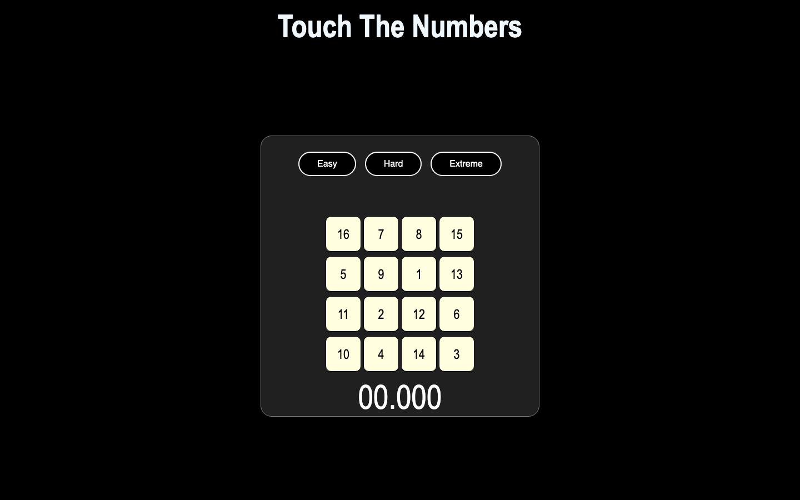
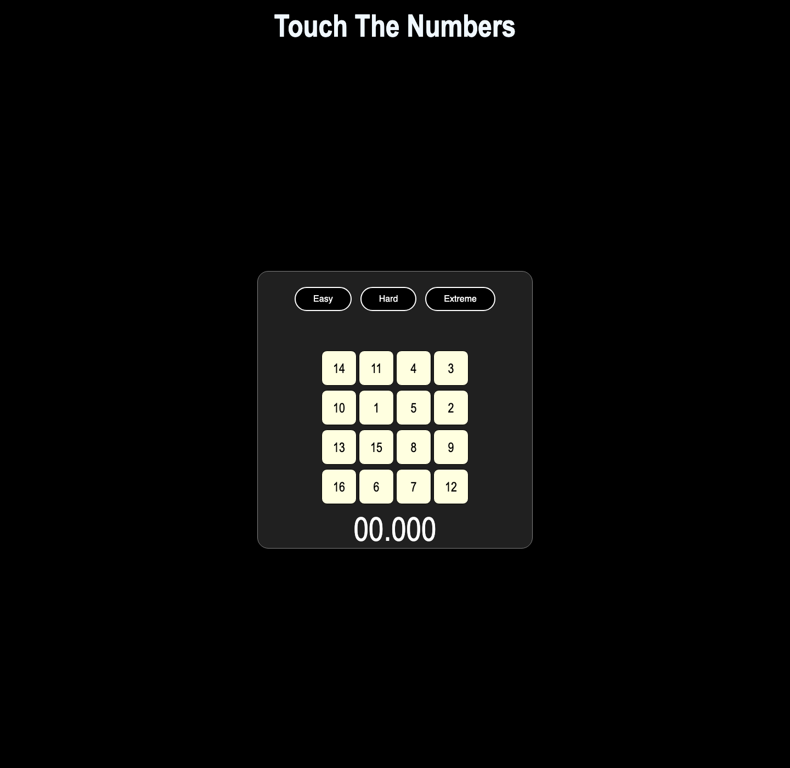
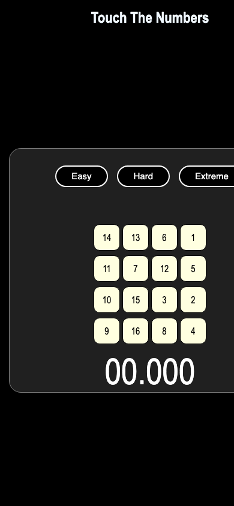

# Touch Numbers

A timed number-ordering game: find and select the numbers in sequence as quickly as possible.

**Live site:** [onchetrit.github.io/touch-numbers](https://onchetrit.github.io/touch-numbers/)

## Tech

Vanilla HTML, CSS, and JavaScript.

## Screenshots

| Desktop | Game detail | Mobile |
| --- | --- | --- |
|  |  |  |

## Run locally

~~~bash
python3 -m http.server 8080
~~~

Then open http://localhost:8080.
